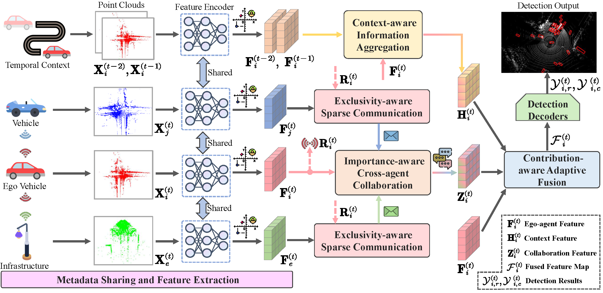

# SCOPE++
The official implementation of submitted paper "Robust Multi-Agent Collaborative Perception
via Spatio-Temporal Awareness".



## Abstract

As an emerging application in autonomous driving, multi-agent collaborative perception has recently received significant attention. 
Despite promising advances from previous efforts, several unavoidable challenges that cause performance bottlenecks remain, 
including the single-frame detection dilemma, communication redundancy, and defective collaboration process.
To this end, We propose SCOPE++, a versatile collaborative perception framework aggregating spatio-temporal information across on-road agents to tackle these issues.
We introduce four components in SCOPE++ for robust collaboration by seeking a reasonable trade-off between perception performance and communication bandwidth.
First, we create a context-aware information aggregation to capture valuable semantic cues in the temporal context and enhance the current local representation of the ego agent. 
Second, an exclusivity-aware sparse communication is introduced to filter perceptually unnecessary information from collaborators and transmit complementary features relative to the ego agent.
Third, we present an importance-aware cross-agent collaboration to incorporate semantic representations of spatially critical locations across agents flexibly. 
Finally, a contribution-aware adaptive fusion is designed to integrate multi-source representations based on dynamic contributions.
SCOPE++ takes a significant step towards robust collaboration by seeking a reasonable trade-off between perception performance and communication bandwidth.
Our framework is evaluated on multiple LiDAR-based collaborative detection datasets in both real-world and simulated datasets, and comprehensive experiments show that SCOPE++ outperforms state-of-the-art methods on all datasets. 

## Installation
Please refer to [OpenCOOD](https://opencood.readthedocs.io/en/latest/md_files/installation.html) and [centerformer](https://github.com/TuSimple/centerformer/blob/master/docs/INSTALL.md) for more installation details.

Here we install the environment based on the OpenCOOD and centerformer repos.

```bash
# Clone the OpenCOOD repo
git clone https://github.com/DerrickXuNu/OpenCOOD.git
cd OpenCOOD

# Create a conda environment
conda env create -f environment.yml
conda activate opencood

# install pytorch
conda install -y pytorch torchvision cudatoolkit=11.3 -c pytorch

# install spconv 
pip install spconv-cu113

# install basic library of deformable attention
git clone https://github.com/TuSimple/centerformer.git
cd centerformer

# install requirements
pip install -r requirements.txt
sh setup.sh

# clone our repo
https://github.com/starfdu1418/SCOPE.git

# install v2xvit into the conda environment
python setup.py develop
python v2xvit/utils/setup.py build_ext --inplace
```

## Data
Please download the [V2XSet](https://drive.google.com/drive/folders/1r5sPiBEvo8Xby-nMaWUTnJIPK6WhY1B6) and [OPV2V](https://drive.google.com/drive/folders/1dkDeHlwOVbmgXcDazZvO6TFEZ6V_7WUu) datasets. The dataset folder should be structured as follows:
```sh
v2xset # the downloaded v2xset data
  ── train
  ── validate
  ── test
opv2v # the downloaded opv2v data
  ── train
  ── validate
  ── test
```

## Getting Started
### Train your model
We follow OpenCOOD to use yaml files to configure the training parameters. You can use the following command to train your own model from scratch or a continued checkpoint:
```sh
python v2xvit/tools/train.py --hypes_yaml ${CONFIG_FILE} [--model_dir  ${CHECKPOINT_FOLDER}]
```
The explanation of the optional arguments are as follows:
- `hypes_yaml`: the path of the training configuration file, e.g. `v2xvit/hypes_yaml/point_pillar_scope.yaml`. You can change the configuration parameters in this provided yaml file.
- `model_dir` (optional) : the path of the checkpoints. This is used to fine-tune the trained models. When the `model_dir` is
given, the trainer will discard the `hypes_yaml` and load the `config.yaml` in the checkpoint folder.

### Test with pretrained model
Run the following command to conduct test:
```sh
python v2xvit/tools/inference.py --model_dir ${CHECKPOINT_FOLDER} --eval_epoch ${EVAL_EPOCH}
```
The explanation of the optional arguments are as follows:
- `model_dir`: the path to your saved model.
- `eval_epoch`: the evaluated epoch number.

## Acknowledgement
Many thanks to Runsheng Xu for the high-quality dataset and codebase, including [V2XSet](https://drive.google.com/drive/folders/1r5sPiBEvo8Xby-nMaWUTnJIPK6WhY1B6), [OPV2V](https://drive.google.com/drive/folders/1dkDeHlwOVbmgXcDazZvO6TFEZ6V_7WUu), [OpenCOOD](https://github.com/DerrickXuNu/OpenCOOD) and [OpenCDA](https://github.com/ucla-mobility/OpenCDA). The same goes for [Where2comm](https://github.com/MediaBrain-SJTU/Where2comm.git) and [centerformer](https://github.com/TuSimple/centerformer.git) for the excellent codebase.


1. train.py 主要是加了两个loss
2. point_pillar_scope.py: 增加了type，返回值和输入值都有所变化